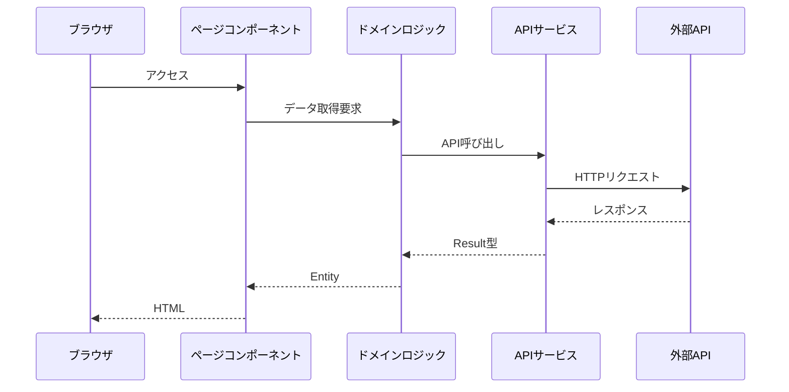

# App Router 実装ルール

## 概要

Next.js の App Router を使用したページコンポーネントの実装ルールを定義します。
ページコンポーネントは、SSR によるデータ取得と SEO 対応を担当する最上位層です。

## 基本方針

1. ページコンポーネントは SSR を基本とする
2. データ取得は`domain/logic/ssr`を使用する
3. SEO 対応が必要な処理を実装する
4. エラー・ローディング状態を適切に処理する

## ファイル構成

```
app/
├── layout.tsx           # 共通レイアウト
├── error.tsx           # エラーハンドリング
├── loading.tsx         # ローディング
├── not-found.tsx      # 404ページ
└── (todo)/            # ルーティンググループ
    ├── layout.tsx     # グループレイアウト
    ├── page.tsx       # 一覧ページ
    ├── register/      # 登録ページ
    │   └── page.tsx
    ├── detail/        # 詳細ページ
    │   └── [id]/
    │       └── page.tsx
    └── edit/          # 編集ページ
        └── [id]/
            └── page.tsx
```

## データフロー



## 実装ルール

### 1. ページコンポーネント

```typescript
// app/todo/page.tsx
export default async function TodoListPage() {
  // データ取得
  const result = await fetchTodosLogic();

  // エラーハンドリング
  if (result.isErr()) {
    throw result.error;
  }

  // 正常系の処理
  return <TodoListClientPage todos={result.value} />;
}
```

### 2. レイアウト

```typescript
// app/layout.tsx
export default function RootLayout({
  children,
}: {
  children: React.ReactNode;
}) {
  return (
    <html lang="ja">
      <body>
        <header>...</header>
        <main>{children}</main>
        <footer>...</footer>
      </body>
    </html>
  );
}
```

### 3. エラーハンドリング

```typescript
// app/error.tsx
"use client";

export default function Error({
  error,
  reset,
}: {
  error: Error;
  reset: () => void;
}) {
  return (
    <div>
      <h2>エラーが発生しました</h2>
      <button onClick={reset}>再試行</button>
    </div>
  );
}
```

### 4. ローディング

```typescript
// app/loading.tsx
export default function Loading() {
  return <ServerComponentLoading />;
}
```

### 5. 404 ページ

```typescript
// app/not-found.tsx
export default function NotFound() {
  return (
    <div>
      <h2>ページが見つかりません</h2>
    </div>
  );
}
```

## メタデータ

### 1. 静的メタデータ

```typescript
// app/layout.tsx
export const metadata: Metadata = {
  title: {
    default: "サイト名",
    template: "%s | サイト名",
  },
  description: "サイトの説明",
};
```

### 2. 動的メタデータ

```typescript
// app/todo/[id]/page.tsx
export async function generateMetadata({
  params,
}: {
  params: { id: string };
}): Promise<Metadata> {
  const result = await fetchTodoLogic(params.id);

  if (result.isErr()) {
    return {
      title: "エラー",
    };
  }

  return {
    title: result.value.title,
    description: result.value.description,
  };
}
```

## 動的ルーティング

### 1. パラメータの型定義

```typescript
// app/todo/[id]/page.tsx
type Props = {
  params: {
    id: string;
  };
};
```

### 2. 静的生成

```typescript
export async function generateStaticParams() {
  const result = await fetchTodosLogic();

  if (result.isErr()) {
    return [];
  }

  return result.value.map((todo) => ({
    id: todo.id,
  }));
}
```

## チェックリスト

### ページコンポーネント

- [ ] SSR でデータを取得している
- [ ] エラーハンドリングを実装している
- [ ] ローディング状態を表示している
- [ ] SEO 対応が必要な場合、メタデータを設定している
- [ ] クライアントページコンポーネントに適切にデータを渡している

### レイアウト

- [ ] 共通の UI を実装している
- [ ] メタデータのデフォルト値を設定している
- [ ] 適切な HTML 構造になっている

### エラーハンドリング

- [ ] エラー画面を実装している
- [ ] リカバリー機能を提供している
- [ ] エラーの種類に応じた表示を分けている

### ルーティング

- [ ] パラメータの型を定義している
- [ ] 必要に応じて静的生成を実装している
- [ ] 404 ページを実装している
