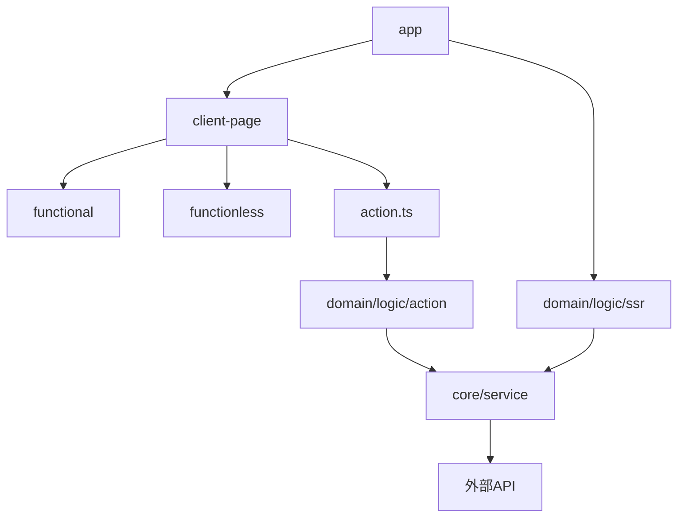
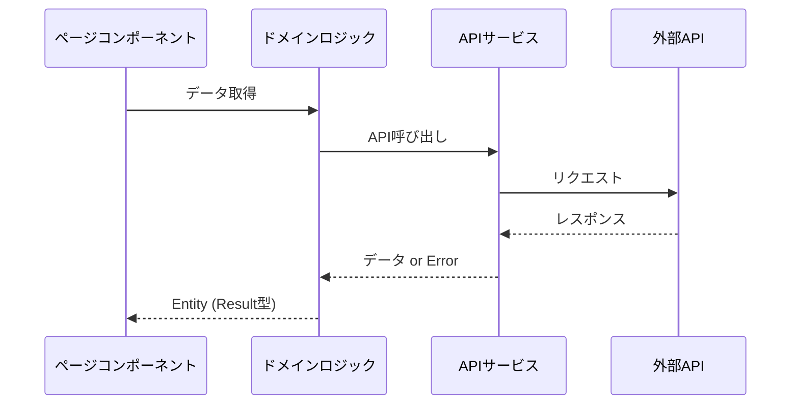
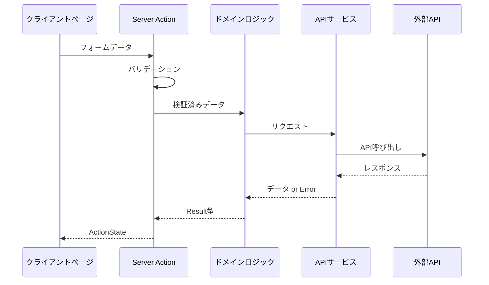

# フロントエンドアーキテクチャ

## 概要

このフロントエンドプロジェクトは、クリーンアーキテクチャの考え方を基にし、Next.js の特有の要件（Server/Client 分離）を考慮したレイヤー設計を採用しています。
コードの依存関係を明確にし、テスタビリティと保守性を高めることを目的としています。

## モノレポ設計

基本方針：このプロジェクトでは、名前空間の概念として捉えているため、フォルダ名は単数形で統一しています。

### ディレクトリ構造

```
frontend/
├──public/                    # 静的ファイル
   └── image/                 # 画像などの静的ファイル
└──src/
   ├── __test__/              # テスト用フォルダ
   ├── app/                   # Next.js App Routerのページとグローバル設定
   ├── component/
   │   ├── functional/        # ビジネスロジックや副作用を内包する共通コンポーネント
   │   └── functionless/      # ビジネスロジックや副作用を持たず、外部から受け取ったものをそのまま使うだけの共通コンポーネント
   │   └── client-page/       # React Hooksやビジネスロジック、副作用をもつことのできるページ固有のコンポーネント
   │        └── action.ts/    # client-pagesの操作を理解しているフォームアクションロジックを定義する。ドメインロジックではない。
   ├── constant/              # 定数定義
   ├── core/
   │    └── service/          # 外部ライブラリの設定・カスタマイズ
   ├── domain/
   │   ├── data/              # Entity定義
   │   └── logic/
   │       ├── ssr/           # SSR用ロジック（src/app配下で利用する。各画面の初期表示のための取得ロジック）
   │       ├── action/        # SSR以外のNext.jsサーバーで行うべき、CRUDなどのロジック（client-pages/actions.tsで利用する。各画面の初期表示後のCRUDロジック）
   │       └── util/          # 汎用ロジック用ロジック
   └── util/                  # ユーティリティ関数
       └── hook/              # 汎用的なカスタムフック
```

### 各レイヤーの依存関係



## アーキテクチャ構成

### 各レイヤーの責務

1. **ページコンポーネント層** (`app/`)

   - 非同期データフェッチを行う最上位層
   - ページのレイアウトとルーティングを管理
   - SEO 対応が必要な処理を実装
   - `domain/logic/ssr`を使用してデータ取得
   - Result 型でエラーハンドリング

2. **クライアントページ層** (`component/client-page/`)

   - 画面に対して 1:1 で作成される
   - UI に関するロジックを実装
   - ServerAction の実行
   - 状態管理（React hooks）
   - `domain/logic/action`を使用してデータ操作
   - フォームアクションロジックを定義（`action.ts`）
   - `domain/logic/action` は必ず`action.ts` から使用する

3. **機能なしコンポーネント層** (`component/functionless/`)

   - 純粋な表示用コンポーネント
   - props を受け取って表示するのみ
   - 内部状態を持たない
   - ビジネスロジックを含まない
   - 再利用可能な UI 部品

4. **機能ありコンポーネント層** (`component/functional/`)

   - 複数の画面で共有される状態を管理
   - 特定の機能に特化した再利用可能なコンポーネント

5. **ドメインロジック層** (`domain/logic/`)

   - アプリケーションのビジネスロジック
   - `ssr/`: SSR 用のデータ取得ロジック
   - `action/`: ServerAction 用のデータ操作ロジック
   - `util/`: ドメイン内で使用される汎用的なロジック
   - Result 型でのエラーハンドリング

6. **API サービス層** (`core/service/`)
   - 外界との通信を行う
   - 各ライブラリの設定を行う
   - 各ライブラリのメソッドをラップしてアプリケーションで使用する関数を作成
   - `domain/logic/` から呼ばれる
   - 外部の詳細は知らず、異常時は単純にエラーをスローする

## ディレクトリ構造

```
src/
├── app/                    # ページコンポーネント
│   ├── layout.tsx         # ルートレイアウト
│   ├── error.tsx          # エラーハンドリング
│   ├── loading.tsx        # ローディング状態
│   └── (todo)/            # ルーティンググループ
│       ├── layout.tsx     # グループレイアウト
│       ├── page.tsx       # トップページ
│       └── [id]/          # 動的ルーティング
├── component/
│   ├── client-page/       # クライアントページ
│   │   └── todo/
│   │       ├── action.ts  # フォームアクションロジック
│   │       ├── TodoListClientPage.tsx
│   │       ├── TodoDetailClientPage.tsx
│   │       ├── TodoEditClientPage.tsx
│   │       └── TodoRegisterClientPage.tsx
│   ├── functional/        # 機能ありコンポーネント
│   │   └── todo/
│   │       ├── TodoList.tsx      # 一覧/詳細/編集画面で使用
│   └── functionless/      # 機能なしコンポーネント
│       ├── general/       # 汎用コンポーネント
│       │   ├── form/
│       │   │   ├── InputText.tsx
│       │   │   ├── InputTextArea.tsx
│       │   │   └── SubmitButton.tsx
│       │   ├── error/
│       │   │   └── ErrorMessage.tsx
│       │   └── loading/
│       │       └── LoadingSpinner.tsx
│       └── todo/         # 機能固有コンポーネント
│           └── TodoForm.tsx
├── core/                  # APIサービス
├── domain/
│   ├── data/             # Entity定義
│   └── logic/
│       ├── ssr/          # SSR用ロジック
│       ├── action/       # ServerAction用ロジック
│       └── util/         # 共通ロジック
└── util/                 # ユーティリティ
```

## データフロー

### 1. SSR フロー



### 2. Server Action フロー



## エラーハンドリング戦略

基本的な考え方：domain/logic 配下では外部通信の詳細を隠蔽し、予期可能なエラーは Result 型で統一的に処理します。

### 1. ドメインロジック層での設計原則

- 外部通信の詳細を隠蔽
  - HTTP エラーコードや API の内部仕様を上位層に漏らさない
  - core/service でのエラーをドメイン固有のエラーに変換
- Result 型によるエラー表現
  - 予期するエラーは例外(throw)ではなく、Result 型で返却
  - エラーの種類を型で表現（例：`FetchTodosError`）
- 一貫したエラー処理
  - 成功・失敗の状態を型安全に表現
  - エラーメッセージの一元管理

```typescript
// domain/logic/ssr/todo/fetch-todos.ts
export type FetchTodosError = {
  type: "FETCH_ERROR";
  message: string;
};

export async function fetchTodosLogic(): Promise<
  Result<TodoEntity[], FetchTodosError>
> {
  try {
    const result = await apiService.api.todo.$get();

    if (!result.ok) {
      return err({ type: "FETCH_ERROR", message: "取得に失敗しました" });
    }

    return ok(transformToTodoEntity(result.data));
  } catch {
    return err({
      type: "FETCH_ERROR",
      message: "予期せぬエラーが発生しました",
    });
  }
}
```

### 2. サーバーサイドレンダリング（SSR）

- Result 型のエラー処理
  - エラーの場合は`not-found`画面に遷移
  - ページコンポーネントで一括してハンドリング
- 予期せぬエラー
  - `error.tsx`で統一的に処理
  - 汎用エラー画面を表示

```typescript
// app/todo/page.tsx
export default async function TodoPage() {
  const result = await fetchTodosLogic();

  if (result.isErr()) {
    notFound();
  }

  return <TodoListClientPage todos={result.value} />;
}
```

### 3. クライアントサイドレンダリング（CSR）

#### ServerActions 内での処理

- バリデーションエラー
  - zod を使用した型安全なバリデーション
  - フィールド単位のエラーメッセージ
- Result 型のエラー
  - ドメインロジックからのエラーを ActionState に変換
  - エラーメッセージの一元管理
- 予期せぬエラー
  - 固定のエラーメッセージを設定
  - ActionState で返却

```typescript
// component/client-page/todo/action.ts
const TODO_ACTION_ERROR_MESSAGES = {
  TODO_ID_NOT_FOUND: "TodoIDが見つかりません",
  TODO_CREATE_ERROR: "Todoの作成に失敗しました",
  TODO_UPDATE_ERROR: "Todoの更新に失敗しました",
} as const;

export async function updateTodoAction(
  prevState: TodoFormActionState,
  formData: FormData
): Promise<TodoFormActionState> {
  // バリデーション
  const validationResult = todoActionFormSchema.safeParse({
    title: formData.get("title"),
    description: formData.get("description"),
    completed: formData.get("completed") === "on",
  });

  if (!validationResult.success) {
    return {
      ...prevState,
      status: ACTION_STATUS.VALIDATION_ERROR,
      error: getFirstValidationErrorMessage(validationResult.error),
      validationErrors: convertValidationErrors(validationResult.error),
    };
  }

  // ドメインロジック呼び出し
  const result = await updateTodoLogic(validationResult.data);

  if (result.isErr()) {
    return {
      ...prevState,
      status: ACTION_STATUS.SERVER_ERROR,
      error: TODO_ACTION_ERROR_MESSAGES.TODO_UPDATE_ERROR,
    };
  }

  return {
    status: ACTION_STATUS.SUCCESS,
    data: result.value,
  };
}
```

#### クライアント側での処理

- フォームアクション
  - エラーメッセージを toast で表示
  - フィールド単位のエラーメッセージを表示
- 一貫した UI 表現
  - ローディング状態の表示
  - エラー状態の表示
  - 成功時のフィードバック

```typescript
// component/client-page/todo/TodoEditClientPage.tsx
export function TodoEditClientPage({ todo }: Props) {
  const [state, formAction] = useFormState(updateTodoAction, null);
  const { showErrorToast } = useToast();

  useEffect(() => {
    if (state?.error) {
      showErrorToast(state.error);
    }
  }, [state]);

  return (
    <TodoFormComponent
      formAction={formAction}
      titleErrorMessage={state?.validationErrors?.title}
      descriptionErrorMessage={state?.validationErrors?.description}
      isPending={state?.status === "pending"}
    />
  );
}
```

## バリデーション戦略

### 1. スキーマ定義

- zod を使用した型安全なバリデーション
- エラーメッセージの一元管理
- 再利用可能なスキーマ定義

```typescript
const TODO_VALIDATION_ERRORS = {
  REQUIRED_TITLE: "タイトルは必須です",
  TITLE_TOO_LONG: "タイトルは100文字以内で入力してください",
  REQUIRED_DESCRIPTION: "説明を入力してください",
} as const;

const todoActionFormSchema = z.object({
  title: z
    .string()
    .min(1, TODO_VALIDATION_ERRORS.REQUIRED_TITLE)
    .max(100, TODO_VALIDATION_ERRORS.TITLE_TOO_LONG),
  description: z.string().min(1, TODO_VALIDATION_ERRORS.REQUIRED_DESCRIPTION),
  completed: z.boolean(),
});
```

### 2. エラーメッセージの変換

- zod のエラーメッセージを表示用に変換
- フィールドの優先順位を定義
- 一貫したエラーメッセージ形式

```typescript
const TODO_FIELD_ORDER = ["title", "description", "completed"] as const;

type TodoValidationErrors = {
  title: string[];
  description: string[];
  completed: string[];
};

function convertValidationErrors(zodError: z.ZodError): TodoValidationErrors {
  const fieldErrors = zodError.flatten().fieldErrors;
  return convertValidationErrors(
    fieldErrors,
    TODO_VALIDATION_ERROR_MESSAGES,
    TODO_FIELD_ORDER
  );
}
```

### 3. バリデーションの実行タイミング

- フォーム送信時
  - ServerAction 内でのバリデーション
  - 全フィールドの検証
- インタラクション時
  - 個別フィールドのバリデーション
  - リアルタイムフィードバック

## 実装ガイドライン

各レイヤーの詳細な実装ルールは以下のドキュメントを参照：

- [ページコンポーネント実装ルール](./app-router.md)
- [クライアントページ実装ルール](./client-page.md)
- [コンポーネント実装ルール](./component.md)
- [ServerAction 実装ルール](./server-action.md)
- [ドメインロジック実装ルール](./domain-logic.md)
- [core サービス実装ルール](./core-service.md)
- [デザイン 実装ルール](./design.md)
- [テスト 実装ルール](./test.md)
