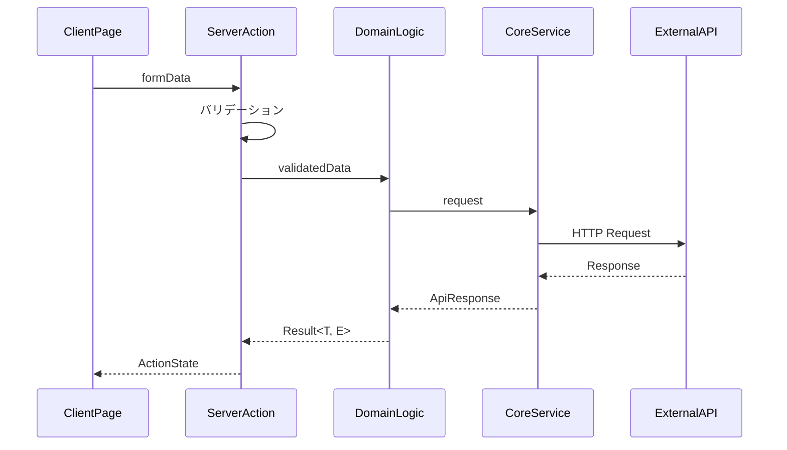

# Server Action 実装ルール

## 概要

Server Action は、Client Page からのフォーム送信を処理し、Domain Logic を呼び出すコンポーネントです。
バリデーション、エラーハンドリング、キャッシュの再検証を主な責務とします。

## 基本方針

1. 必ず"use server"ディレクティブを記述
2. Zod を使用したバリデーション
3. Domain Logic の`action`を使用したデータ操作
4. Result 型に基づくエラーハンドリング

## ファイル構成

```
components/client-pages/
└── todo/
    ├── actions.ts           # Server Actions
    └── TodoListClientPage.tsx
```

## データフロー



## 実装ルール

### 1. 基本構造

```typescript
// components/client-pages/todo/actions.ts
"use server";

import { revalidatePath } from "next/cache";
import { z } from "zod";
import type { ActionState } from "@/utils/actions";
import { createTodoUseCase } from "@/domain/logic/action/todo/create-todo";

// ✅ バリデーションスキーマ
const todoActionFormSchema = z.object({
  title: z.string().min(1, "タイトルは必須です"),
  description: z.string().min(1, "説明は必須です"),
});

// ✅ ActionState型の定義
export type TodoFormActionState = ActionState<
  TodoFormFields,
  TodoValidationErrors
>;

// ✅ Server Action
export async function createTodoAction(
  prevState: TodoFormActionState,
  formData: FormData
): Promise<TodoFormActionState> {
  // フォームデータの取得
  const formFields = {
    title: formData.get("title") as string,
    description: formData.get("description") as string,
  };

  // ✅ バリデーション
  const validationResult = todoActionFormSchema.safeParse(formFields);
  if (!validationResult.success) {
    return {
      ...formFields,
      status: "error",
      validationErrors: validationResult.error.flatten().fieldErrors,
    };
  }

  try {
    // ✅ domain/logic/actionを使用
    const result = await createTodoUseCase(validationResult.data);

    if (result.isErr()) {
      // ✅ エラー型に応じた処理
      switch (result.error.type) {
        case "TODO_CREATE_FAILED":
          return {
            ...formFields,
            status: "error",
            error: "Todoの作成に失敗しました",
          };
        default:
          return {
            ...formFields,
            status: "error",
            error: "予期せぬエラーが発生しました",
          };
      }
    }

    // ✅ キャッシュの再検証
    revalidatePath("/");
    return {
      status: "success",
      data: result.value,
    };
  } catch (error) {
    return {
      ...formFields,
      status: "error",
      error: "予期せぬエラーが発生しました",
    };
  }
}
```

### 2. バリデーション

```typescript
// components/client-pages/todo/actions.ts
const updateTodoSchema = z.object({
  id: z.number(),
  title: z.string().min(1, "タイトルは必須です"),
  description: z.string(),
  isCompleted: z.boolean(),
});

export async function updateTodoAction(
  prevState: TodoFormActionState,
  formData: FormData
): Promise<TodoFormActionState> {
  // ✅ 型安全なバリデーション
  const validationResult = updateTodoSchema.safeParse({
    id: Number(formData.get("id")),
    title: formData.get("title"),
    description: formData.get("description"),
    isCompleted: formData.get("isCompleted") === "on",
  });

  if (!validationResult.success) {
    // ✅ バリデーションエラーの詳細を返却
    return {
      status: "error",
      validationErrors: validationResult.error.flatten().fieldErrors,
    };
  }

  // 以降の処理...
}
```

### 3. エラーハンドリング

```typescript
// components/client-pages/todo/actions.ts
export async function deleteTodoAction(
  prevState: TodoFormActionState,
  formData: FormData
): Promise<TodoFormActionState> {
  const id = Number(formData.get("id"));

  try {
    const result = await deleteTodoUseCase(id);

    if (result.isErr()) {
      // ✅ エラー型に応じたメッセージ
      switch (result.error.type) {
        case "TODO_NOT_FOUND":
          return {
            status: "error",
            error: "指定されたTodoが見つかりません",
          };
        case "TODO_DELETE_FAILED":
          return {
            status: "error",
            error: "Todoの削除に失敗しました",
          };
        default:
          return {
            status: "error",
            error: "予期せぬエラーが発生しました",
          };
      }
    }

    revalidatePath("/");
    return { status: "success" };
  } catch (error) {
    return {
      status: "error",
      error: "予期せぬエラーが発生しました",
    };
  }
}
```

## 実装チェックリスト

### バリデーション

- [ ] 適切なバリデーションスキーマが定義されているか
- [ ] 必要なフィールドのバリデーションが実装されているか
- [ ] バリデーションエラーメッセージは適切か
- [ ] 型変換が適切に行われているか

### エラーハンドリング

- [ ] Result 型のエラーを適切に処理しているか
- [ ] エラー型に応じたメッセージを返しているか
- [ ] 予期せぬエラーを適切に処理しているか
- [ ] エラー情報が適切にクライアントに伝わるか

### キャッシュ管理

- [ ] 必要な箇所で revalidatePath を呼び出しているか
- [ ] キャッシュの再検証範囲は適切か
- [ ] 不要なキャッシュの再検証を避けているか

### 型安全性

- [ ] ActionState 型が適切に定義されているか
- [ ] フォームデータの型変換が安全か
- [ ] Result 型の型情報が維持されているか
- [ ] 戻り値の型が適切か

## 注意事項

1. 必ず"use server"ディレクティブを記述する
2. バリデーションは必ず実装する
3. エラー型に応じた適切な処理を実装する
4. 必要な箇所でのみキャッシュを再検証する
5. 型安全性を確保する
